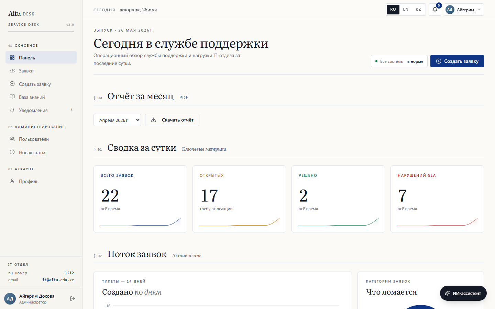
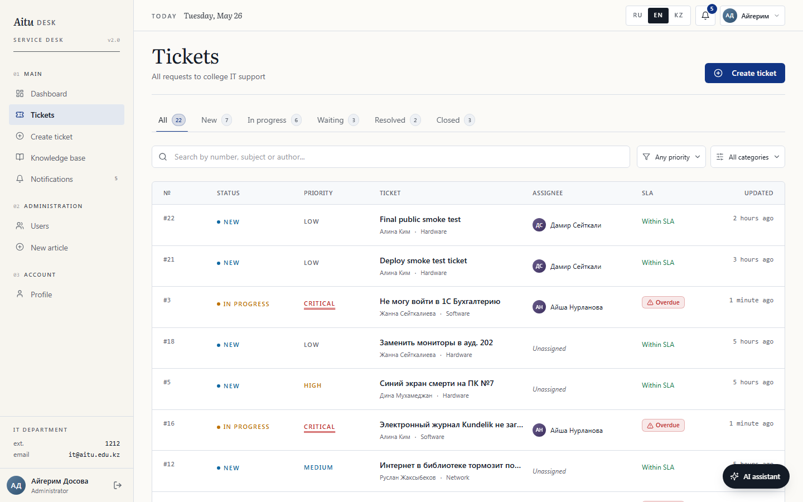
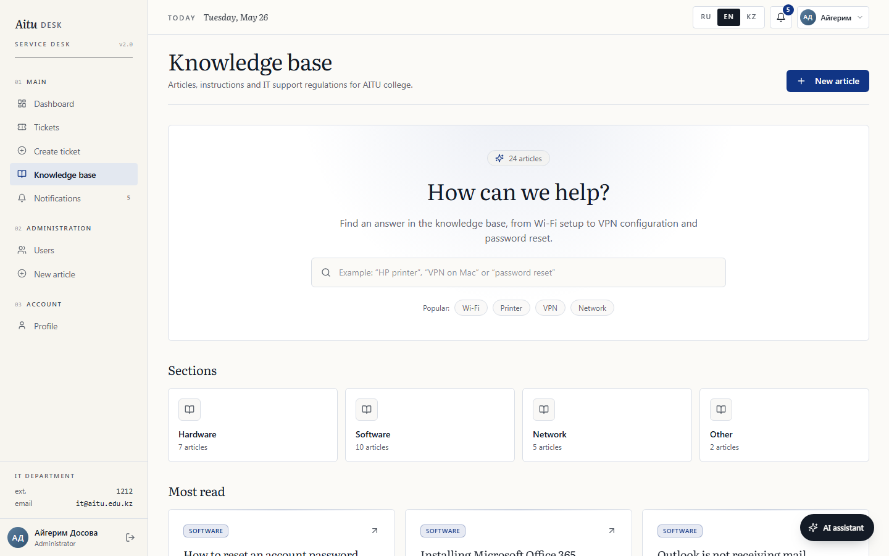

# AituDesk

> Fullstack service desk platform for a college IT department: tickets, real-time chat, SLA control, multilingual knowledge base, AI/RAG support assistant, analytics, monitoring, and PDF reports.

`React 18` · `TypeScript` · `Vite` · `Node.js 20` · `Express` · `Prisma` · `PostgreSQL` · `Socket.IO` · `i18next` · `Docker Compose`

**Live demo:** [aitudesk.vercel.app](https://aitudesk.vercel.app)  
**Backend health:** [aitudesk-backend.onrender.com/api/health](https://aitudesk-backend.onrender.com/api/health)  
**Free deployment:** Vercel + Render Free + Neon Free, without Supabase.

AituDesk is built as a complete diploma-ready product rather than a mockup. It includes a role-aware ticket workflow, Socket.IO updates, multilingual official Knowledge Base content, AI support routing, PDF reporting, Prometheus metrics, Grafana dashboards, and a polished editorial UI.

---

## Preview

### Dashboard



### Tickets



### Knowledge Base



---

## Highlights

- **Role-based workspace:** USER, AGENT, ADMIN with protected routes and API-level RBAC.
- **Ticket lifecycle:** NEW, IN_PROGRESS, WAITING, RESOLVED, CLOSED, REOPENED.
- **Real-time support chat:** public messages, internal agent notes, typing state, status updates.
- **SLA engine:** response/resolve deadlines, waiting pause, breach detection, dashboard metrics.
- **Multilingual UI:** Russian, English, Kazakh with i18next and localStorage persistence.
- **Multilingual KB:** official articles stored in RU/EN/KK, localized API responses, no live auto-translation.
- **AI/RAG assistant:** OpenAI-compatible provider, KB sources, IT-support scope routing, controlled fallbacks.
- **Reports:** monthly PDF reports generated with pdf-lib and worker_threads.
- **Monitoring:** Prometheus endpoint and Grafana provisioning for local/dev observability.
- **Deployment-ready:** Docker Compose locally, Vercel/Render/Neon for free public hosting.

---

## Demo Accounts

| Role | Email | Password |
|---|---|---|
| Admin | `admin@aitudesk.kz` | `Admin123!` |
| Agent | `agent1@aitudesk.kz` | `Agent123!` |
| User | `user1@aitudesk.kz` | `User123!` |

The seed script is idempotent. It creates base users, agents, SLA policies, demo tickets, and 24 multilingual KB articles without deleting existing user tickets/messages/ratings during ordinary startup.

---

## Quick Start

```bash
git clone https://github.com/seoshiro/aitudesk.git
cd aitudesk
docker compose up -d --build
```

Local URLs:

| Service | URL |
|---|---|
| Frontend | http://localhost:7754 |
| Backend health | http://localhost:4829/api/health |
| pgAdmin | http://localhost:5050 |
| Prometheus | http://localhost:8800 |
| Grafana | http://localhost:9911 |

Production deployment instructions are in [DEPLOYMENT.md](DEPLOYMENT.md).

## Стек

| Слой | Технологии |
|---|---|
| **Frontend** | React 18, TypeScript, Vite 5, React Router 6, Zustand, Tailwind CSS v3, shadcn/ui, Recharts, Socket.IO client, sonner, lucide-react, i18next, react-i18next |
| **Backend** | Node 20, Express 4, TypeScript, Prisma 5, Socket.IO, Zod, JWT, bcrypt, Multer, Helmet, OpenAI SDK, pdf-lib, prom-client |
| **Database** | PostgreSQL 17 |
| **i18n** | RU / EN / KK, translation JSON, browser language detector, localStorage, Intl.DateTimeFormat |
| **AI** | OpenAI-compatible SDK, RAG по мультиязычной базе знаний, IT-support routing, controlled fallbacks |
| **Runtime** | Docker Compose (6 сервисов) |
| **Typography** | **Literata** (serif, editorial), **Geist Sans / Geist Mono** |

Визуальный язык — editorial/газета: serif-заголовки, § нумерация секций, тонкие границы, строгая типографика.

---

## Документация для защиты

- **README.md** — техническая документация: запуск, стек, архитектура, API, мониторинг, тесты.
- **GUIDE.md** — готовый гайд для дипломной защиты: структура выступления, демо-сценарий, сильные стороны проекта, вопросы комиссии и ответы.
- **DEPLOYMENT.md** — бесплатный публичный деплой без Supabase: Vercel + Render + Neon.

---

## Быстрый старт

### Требования
- Docker Desktop (запущен)
- Свободные порты `5432`, `4829`, `7754`, `5050`, `8800`, `9911`

### Запуск
```bash
git clone <repo-url> aitudesk
cd aitudesk
docker compose up -d --build
```

Первый запуск: ~2–3 минуты (скачивание образов + сборка + автомиграция Prisma + seed).

### Адреса

| Сервис | URL |
|---|---|
| Frontend (SPA) | http://localhost:7754 |
| Backend health | http://localhost:4829/api/health |
| pgAdmin | http://localhost:5050 |
| Prometheus | http://localhost:8800 |
| Grafana | http://localhost:9911 (admin/admin) |
| PostgreSQL | `localhost:5432` (внешний) / `postgres:5432` (внутренний) |

---

## Тестовые аккаунты

Данные создаются seed-скриптом автоматически (идемпотентно).

| Роль | Email | Пароль |
|---|---|---|
| Администратор | `admin@aitudesk.kz` | `Admin123!` |
| Агент 1 | `agent1@aitudesk.kz` | `Agent123!` |
| Агент 2 | `agent2@aitudesk.kz` | `Agent123!` |
| Агент 3 | `agent3@aitudesk.kz` | `Agent123!` |
| Пользователи | `user1@aitudesk.kz` … `user5@aitudesk.kz` | `User123!` |

После seed в базе ~20 тикетов (разные статусы/приоритеты), сообщения, оценки и **24 статьи базы знаний** с тегами (по всем категориям: SOFTWARE, HARDWARE, NETWORK, ACCESS, OTHER).

---

## Роли и возможности

- **USER** — создаёт заявки, видит свои, пишет в чате, закрывает/переоткрывает решённые, ставит оценку 1–5.
- **AGENT** — видит назначенные и свободные `NEW`, меняет статусы (`IN_PROGRESS` / `WAITING` / `RESOLVED`), пишет публичные и внутренние заметки.
- **ADMIN** — всё выше + переназначение, управление ролями и специализациями агентов, редактирование базы знаний, полный дашборд с аналитикой.

---

## Структура проекта

```
aitudesk/
├── backend/
│   ├── prisma/
│   │   ├── schema.prisma    # User, Ticket, TicketMessage, Attachment,
│   │   │                    # Rating, Notification, KnowledgeArticle,
│   │   │                    # KnowledgeArticleTranslation, SlaPolicy
│   │   └── seed.ts          # Idempotent seed: юзеры, агенты, KB RU/EN/KK
│   ├── src/
│   │   ├── routes/          # auth, users, tickets, messages,
│   │   │                    # knowledge, notifications, dashboard,
│   │   │                    # ai (RAG-ассистент), reports (PDF)
│   │   ├── middleware/      # auth (JWT), validate (Zod), upload (Multer),
│   │   │                    # httpMetrics (Prometheus + route normalization)
│   │   ├── services/        # SLA (дедлайны + фон. проверка),
│   │   │                    # auto-assignment (по категории),
│   │   │                    # report.service (PDF-генерация),
│   │   │                    # reportRunner (worker thread launcher)
│   │   ├── workers/         # pdfReport.worker.ts (worker_threads)
│   │   ├── lib/             # prisma, metrics, dbMetrics (Database Exporter)
│   │   ├── socket/          # Socket.IO: rooms, typing, status
│   │   └── index.ts
│   ├── Dockerfile
│   ├── entrypoint.sh        # prisma db push → seed → node dist
│   ├── assets/fonts/        # PT Sans Regular/Bold для PDF с кириллицей
│   └── .env
├── frontend/
│   ├── src/
│   │   ├── pages/
│   │   │   ├── dashboard/DashboardPage.tsx
│   │   │   ├── tickets/    # List, Create, Detail
│   │   │   ├── kb/         # List, Article, Editor
│   │   │   ├── notifications/NotificationsPage.tsx
│   │   │   ├── admin/UsersPage.tsx
│   │   │   ├── profile/ProfilePage.tsx
│   │   │   ├── auth/       # Login, Register
│   │   │   └── NotFoundPage.tsx
│   │   ├── components/
│   │   │   ├── ui/                 # shadcn/ui (button, input, sonner…)
│   │   │   ├── page-header.tsx
│   │   │   ├── stat-card.tsx       # KPI со спарклайнами
│   │   │   ├── dashboard-charts.tsx # Recharts (line + donut)
│   │   │   ├── ticket-badges.tsx
│   │   │   ├── user-avatar.tsx
│   │   │   ├── empty-state.tsx
│   │   │   ├── app-sidebar.tsx / app-topbar.tsx / brand.tsx
│   │   │   └── tickets/, notifications/  (legacy stubs)
│   │   ├── store/            # authStore, notifStore, themeStore, toastStore
│   │   ├── i18n/             # i18next init + locales ru/en/kk
│   │   ├── lib/              # mappers (translation keys), locale, даты, utils
│   │   ├── api/axios.ts      # interceptor + refresh flow
│   │   ├── socket/socket.ts  # connect / rooms / typing
│   │   ├── layouts/          # AppLayout, AuthLayout
│   │   └── App.tsx           # Роуты (+ ProtectedRoute по ролям)
│   ├── scripts/              # check-i18n.mjs
│   ├── index.html
│   ├── nginx.conf            # SPA + proxy /api → backend, /socket.io WS
│   └── Dockerfile
├── monitoring/
│   ├── prometheus.yml        # Scrape config
│   └── grafana/provisioning/ # Datasource + dashboard auto-provisioning
├── docker-compose.yml        # postgres / backend / frontend / pgadmin / prometheus / grafana
├── .env                      # Порты и БД-креды корневого compose
├── package.json
└── GUIDE.md                 # шпаргалка для дипломной защиты
```

---

## Жизненный цикл тикета

```
NEW ──▶ IN_PROGRESS ──▶ WAITING ──▶ RESOLVED ──▶ CLOSED
 ▲           │             │            │
 └───────────┴─────────────┴── REOPENED ┘
```

- `NEW` — создан пользователем, ждёт назначения (автоматически по категории, если есть свободный агент)
- `IN_PROGRESS` — агент работает, SLA идёт
- `WAITING` — ожидание ответа пользователя; SLA таймер ставится на паузу через `waitingSince`
- `RESOLVED` — агент отметил решённым, можно оставить оценку
- `CLOSED` — пользователь подтвердил; тикет в архиве
- `REOPENED` — возврат в работу, SLA пересчитывается от текущего момента

---

## SLA по приоритетам

| Приоритет | Время реакции | Время решения |
|---|---|---|
| `CRITICAL` | 2 ч | 4 ч |
| `HIGH` | 4 ч | 8 ч |
| `MEDIUM` | 8 ч | 24 ч |
| `LOW` | 24 ч | 72 ч |

Фоновый воркер (`checkSlaBreaches`) раз в минуту проставляет `slaBreached=true` просроченным тикетам, которые не в статусе `WAITING/RESOLVED/CLOSED`.

---

## Сокеты (реал-тайм)

| Событие | Направление | Описание |
|---|---|---|
| `ticket:join` / `ticket:leave` | client → server | подписка на комнату тикета |
| `typing:start` / `typing:stop` | client ↔ server | индикатор «печатает…» |
| `message:new` | server → client | новое сообщение в тикете |
| `ticket:status` | server → client | смена статуса тикета |
| `notification:new` | server → client | персональное уведомление |

Авторизация — JWT в `auth.token` при `io()`.

---

## API — ключевые эндпоинты

Все защищены JWT (`Authorization: Bearer <accessToken>`), кроме `/auth/*`.

| Метод | Путь | Описание |
|---|---|---|
| POST | `/api/auth/register` | Регистрация |
| POST | `/api/auth/login` | Логин, `{ accessToken, user }` |
| POST | `/api/auth/refresh` | Продление токена (cookie) |
| POST | `/api/auth/logout` | Выход |
| GET | `/api/users/me` / PUT `/api/users/me` | Профиль |
| POST | `/api/users/me/avatar` | Загрузка аватара |
| GET | `/api/users` (ADMIN) | Список |
| PUT | `/api/users/:id/role` (ADMIN) | Роль + специализации |
| GET | `/api/tickets?status=…&priority=…&category=…&search=…` | Список (role-aware) |
| GET | `/api/tickets/:id` | Детали |
| POST | `/api/tickets` | Создание (multipart, до 5 файлов) |
| PUT | `/api/tickets/:id/status` | Смена статуса |
| PUT | `/api/tickets/:id/assign` (ADMIN) | Переназначение |
| POST | `/api/tickets/:id/rate` | Оценка 1–5 |
| GET/POST | `/api/tickets/:id/messages` | Чат |
| GET | `/api/kb/articles?search=&category=` | База знаний |
| GET/POST/PUT/DELETE | `/api/kb/articles/:id` | CRUD (ADMIN) |
| GET | `/api/notifications` | Мои уведомления |
| PUT | `/api/notifications/read-all` | Все прочитаны |
| GET | `/api/dashboard/stats` | Метрики по роли |
| GET | `/api/dashboard/tickets-by-day` | 14-дневный тренд |
| GET | `/api/dashboard/by-category` | Распределение по категориям |
| GET | `/api/dashboard/agents` (ADMIN) | Топ агентов |
| POST | `/api/ai/chat` | AI/RAG-ассистент IT-поддержки |
| GET | `/api/reports/monthly?month=YYYY-MM` | PDF-отчёт за месяц |
| GET | `/metrics` | Prometheus метрики |

---

## Мультиязычность интерфейса

Frontend поддерживает три языка:

| Код | Язык | Intl locale |
|---|---|---|
| `ru` | Русский | `ru-RU` |
| `en` | English | `en-US` |
| `kk` | Қазақша | `kk-KZ` |

Архитектура:

- `frontend/src/i18n/index.ts` — инициализация i18next, fallback `ru`, detection/persistence через localStorage.
- `frontend/src/i18n/locales/ru.json`, `en.json`, `kk.json` — словари интерфейса.
- `frontend/scripts/check-i18n.mjs` — проверка, что структуры ключей во всех языках совпадают.
- `frontend/src/lib/locale.ts` — нормализация языка и выбор locale для дат.
- `frontend/src/lib/mappers.ts` — translation keys для статусов, приоритетов, категорий, ролей и notification types.

Переводится только UI: меню, кнопки, формы, placeholders, toast-уведомления, empty states, фильтры, статусы, приоритеты, категории, графики, dashboard, auth, profile/admin, notifications, tickets и KB UI.

Пользовательский контент не переводится автоматически: subject/description тикетов, чат, internal notes, rating comments, filenames, имена и email. Knowledge Base — исключение: это официальный контент приложения, поэтому статьи имеют сохранённые версии RU/EN/KK в БД.

Проверка переводов:

```bash
cd frontend
npm run i18n:check
```

---

## Мультиязычная база знаний

KB хранит официальный контент приложения на трёх языках.

Prisma-модели:

- `KnowledgeArticle` — общие поля статьи: категория, теги, публикация, просмотры, timestamps.
- `KnowledgeArticleTranslation` — `locale`, `title`, `content`, `slug` для `ru/en/kk`.
- `KnowledgeLocale` — enum `ru | en | kk`.

Backend API выбирает язык через `?lang=ru|en|kk` или `Accept-Language`. Если перевода нет, fallback — русский. Список статей возвращает локализованные `title/excerpt`, detail page возвращает локализованные `title/content`. Admin editor позволяет редактировать версии RU / EN / KK.

Seed создаёт базовые KB articles через idempotent upsert и не удаляет пользовательские тикеты, сообщения, оценки или существующие KB-статьи при обычном запуске backend.

---

## Конфигурация

Корневой `.env` (порты и БД):
```env
POSTGRES_DB=aitudesk
POSTGRES_USER=aitudesk_user
POSTGRES_PASSWORD=aitudesk_super_secret_2024
BACKEND_PORT=4829
FRONTEND_PORT=7754
PGADMIN_EMAIL=admin@aitudesk.kz
PGADMIN_PASSWORD=pgadmin_secret_2024
```

`backend/.env` — JWT, upload, seed-пароли, AI-провайдер. Значения по умолчанию подходят для локального запуска.

```env
# AI Assistant — любой OpenAI-совместимый провайдер
AI_API_KEY=your_provider_api_key_here
AI_BASE_URL=https://api.groq.com/openai/v1
AI_MODEL=llama-3.3-70b-versatile
```

Поддерживаются Groq, Google Gemini, OpenRouter, NVIDIA, OpenAI и любой другой провайдер с OpenAI-совместимым API — достаточно поменять три переменные.

Пример для OpenRouter:

```env
AI_BASE_URL=https://openrouter.ai/api/v1
AI_MODEL=openrouter/auto
```

Frontend при сборке получает `VITE_API_URL=/api` и `VITE_SOCKET_URL=""` (same-origin через Nginx).

---

## Команды

```bash
# Запуск стека
docker compose up -d --build

# Состояние
docker compose ps

# Логи
docker logs -f aitudesk_backend
docker logs -f aitudesk_frontend

# Стоп
docker compose down

# Стоп + очистка БД
docker compose down -v

# Ре-сборка одного сервиса
docker compose up -d --build backend
```

### Локально без Docker (dev-режим)
```bash
# Backend
cd backend
cp .env .env.local      # отредактируйте DATABASE_URL под локальный postgres
npm install
npx prisma generate
npx prisma db push
npm run db:seed
npm run dev             # :4000

# Frontend
cd frontend
npm install
npm run dev             # :5173 (Vite)
```

---

## pgAdmin

1. Откройте http://localhost:5050 → вход `admin@aitudesk.kz` / `pgadmin_secret_2024`.
2. **Add New Server** → Connection:
   - Host: `postgres`
   - Port: `5432`
   - Database: `aitudesk`
   - Username: `aitudesk_user`
   - Password: `aitudesk_super_secret_2024`

---

## Безопасность

- JWT Access (15 мин) + Refresh (7 дн, httpOnly cookie)
- Bcrypt для паролей
- Zod-валидация входных данных
- Helmet, CORS, compression
- Role-based access control на уровне роутов и фронт-роутера
- Rate-limited auth (можно расширить)

---

## Что внутри фронтенда

- **i18n** — полный UI на RU/EN/KK, компактный language switcher в topbar, сохранение языка в localStorage, проверка структуры ключей.
- **Editorial design** — Literata для заголовков, Geist Mono для чисел/ID, тонкие hairlines, § нумерация блоков.
- **DashboardPage** — 4 KPI-карточки со спарклайнами, линейный график за 14 дней, donut по категориям, лента свежих тикетов, топ агентов, блок KB, сводка SLA.
- **TicketListPage** — статус-табы с счётчиками, фильтры (приоритет/категория), серверный поиск, таблица с бейджами и SLA-статусом.
- **TicketDetailPage** — двухколоночный лэйаут: детали/описание слева, **sticky-чат справа** (публичные + INTERNAL-заметки, typing-индикатор, автообновление через socket), быстрые действия по роли/статусу, модуль оценки.
- **CreateTicketPage** — форма + подсказки из KB (debounce-поиск), выбор приоритета плитками, вложения до 5 файлов.
- **KB** — hero-поиск, плитки разделов, рекомендуемое, список; editorial article view; multilingual editor для ADMIN с полями RU / EN / KK.
- **NotificationsPage** — лента с иконкой по типу (`NEW_MESSAGE`, `TICKET_ASSIGNED`, `STATUS_CHANGED`, `TICKET_RATED`), «прочитать все», ссылка на тикет.
- **AIAssistantWidget** — floating AI-чат IT-поддержки с RAG-источниками и controlled fallbacks вместо пустых ответов.

---

## Мониторинг (Prometheus + Grafana)

В стек добавлены Prometheus и Grafana для сбора и визуализации метрик.

### Метрики

#### Application-level (prom-client counters/histograms)

| Метрика | Тип | Описание |
|---|---|---|
| `tickets_total` | Counter | Всего создано тикетов |
| `tickets_resolved_total` | Counter | Всего закрыто тикетов |
| `ticket_resolution_duration_seconds` | Histogram | Время решения тикета (секунды) |
| `http_requests_total` | Counter | HTTP-запросы (method, route, status) |
| `http_request_duration_seconds` | Histogram | Длительность HTTP-запросов |
| `aitudesk_*` | Default | Стандартные Node.js метрики (CPU, memory, event loop) |

#### Database Exporter Pattern (gauges с async collect)

| Метрика | Описание |
|---|---|
| `aitudesk_tickets_by_status` | Количество тикетов в разрезе статуса |
| `aitudesk_tickets_by_category` | Количество тикетов по категориям |
| `aitudesk_tickets_by_priority` | Количество тикетов по приоритетам |
| `aitudesk_tickets_sla_breached` | Количество тикетов с нарушенным SLA |
| `aitudesk_users_total` | Всего пользователей по ролям |
| `aitudesk_kb_articles_total` | Количество статей в базе знаний |

> **Database Exporter** — при каждом скрейпе `/metrics` prom-client вызывает `collect()`, который делает `SELECT COUNT(*)` прямо из PostgreSQL. Это **restart-safe** (не обнуляется при перезапуске), **multi-instance safe** и использует БД как single source of truth.

#### Нормализация роутов

HTTP-метрики автоматически нормализуют пути: UUID, CUID, числовые ID и hex-строки заменяются на `:id`, trailing slash убирается. Это предотвращает взрыв кардинальности в Prometheus.

Эндпоинт: `GET /metrics` (без авторизации) — формат Prometheus.

### Grafana Dashboard

Дашборд **"AituDesk — Service Desk Monitoring"** провизионируется автоматически при первом запуске. Содержит панели:

- **HTTP Requests Rate** — RPS по route/method
- **HTTP Latency (p95)** — перцентили по эндпоинтам
- **Tickets by Status / Category / Priority** — DB Exporter gauges
- **SLA Breached** — тикеты с нарушенным SLA
- **Node.js Memory / Event Loop Lag** — runtime-метрики

| Сервис | URL | Логин |
|---|---|---|
| Prometheus | http://localhost:8800 | — |
| Grafana | http://localhost:9911 | `admin` / `admin` |

Prometheus автоматически скрейпит `backend:4000/metrics` каждые 15 секунд.

---

## PDF-отчёты

### Эндпоинт

`GET /api/reports/monthly?month=YYYY-MM` — генерирует PDF-отчёт за указанный месяц.

Содержит:
- Количество созданных и закрытых тикетов
- Количество открытых тикетов
- Количество нарушений SLA
- Среднее время решения (часы)
- Средний рейтинг удовлетворённости
- Разбивку тикетов по категориям
- Разбивку тикетов по приоритетам

Заголовки ответа: `Content-Type: application/pdf`, `Content-Disposition: attachment`.

### Дизайн отчёта

PDF выполнен в том же editorial-стиле, что и интерфейс:

- **Русская типографика** — PT Sans Regular/Bold через `@pdf-lib/fontkit`
- **§-секции** — «Ключевые метрики», «Разбивка по категориям», «Разбивка по приоритетам»
- **Цветные KPI-карточки** — создано, закрыто, открыто, среднее время, удовлетворённость, SLA
- **Горизонтальные бары** — понятная визуальная аналитика без тяжёлых chart-библиотек
- **Worker Thread** — генерация не блокирует основной event loop

### Worker Thread

PDF-генерация вынесена в **worker_threads** (`src/workers/pdfReport.worker.ts`), чтобы не блокировать event loop. Основной поток собирает данные из Prisma, а тяжёлая работа с `pdf-lib` выполняется в отдельном потоке. При недоступности worker'а используется синхронный fallback.

```
Express route → собирает данные (Prisma) → reportRunner → Worker Thread → pdf-lib → Buffer
                                             ↓ fallback
                                         report.service (in-process)
```

### Фронтенд

На дашборде (для AGENT / ADMIN) добавлена секция **«Отчёт за месяц»** — выпадающий список последних 6 месяцев и кнопка «Скачать отчёт».

---

## Тесты (Vitest + Supertest)

### Инструменты

| Инструмент | Назначение |
|---|---|
| **Vitest** | Фреймворк для запуска тестов (совместим с Vite, быстрый, ESM-first) |
| **Supertest** | HTTP-клиент для тестирования Express-приложений в памяти (без сети) |
| **@vitest/coverage-v8** | Подсчёт покрытия кода тестами (v8-провайдер) |

### Запуск

```bash
cd backend
npm test              # watch-режим (перезапуск при изменении файлов)
npx vitest run        # однократный прогон
npm run test:coverage # однократный прогон + отчёт по покрытию (text + html + lcov)
```

### Подход: моки вместо реальной БД

Тесты не требуют PostgreSQL. Prisma-клиент заменяется моком (`vi.mock`) — при вызове, например, `prisma.user.findUnique` возвращается заранее заданный объект. Это даёт:
- **Скорость** — полный прогон за ~5 секунд
- **Изоляцию** — тесты не зависят от данных в базе
- **Повторяемость** — одинаковый результат на любой машине

```
Реальный запрос:  Браузер → Express → Prisma → PostgreSQL → ответ
Тестовый запрос:  Supertest → Express → Mock Prisma (данные в памяти) → ответ
```

Файлы тестов: `backend/tests/*.test.ts`, конфигурация: `backend/vitest.config.ts`, setup: `backend/tests/setup.ts`.

### Покрытие (114 тестов, 12 модулей)

| Модуль | Кол-во | Что тестируется |
|---|---|---|
| `auth` | 12 | register (успех, дубликат, невалидный ввод), login (верный/неверный пароль), logout, refresh без cookie |
| `tickets` | 28 | Создание, список (фильтры, пагинация, поиск), получение по ID, контроль доступа USER, смена статусов (IN_PROGRESS → RESOLVED → CLOSED), переназначение (ADMIN), рейтинг (1–5, только CLOSED, только создатель) |
| `users` | 11 | Профиль, обновление, список (ADMIN), смена ролей (ADMIN), агенты, RBAC |
| `messages` | 6 | Получение, создание, INTERNAL-запрет для USER, пустой контент, 404 |
| `dashboard` | 10 | Статистика по роли (USER/AGENT/ADMIN), tickets-by-day, by-category, agents, RBAC |
| `knowledge` | 12+ | Список, поиск, фильтр по категории, локализация RU/EN/KK, viewCount++, CRUD (ADMIN), RBAC |
| `notifications` | 4 | Список + unreadCount, read-all, read по id, 401 |
| `reports` | 6 | PDF-генерация (%PDF magic bytes), content-type, content-disposition, валидация month, невалидный месяц |
| `ai` | 11 | greeting, unclear, off-topic, RAG context, empty model reply, provider error, IT fallback для мыши/клавиатуры/аккаунта |
| `metrics` | 8 | Инкремент счётчиков, observe гистограмм, формат Prometheus, метки method/route/status |
| `sla` | 5 | calculateSlaDeadlines для CRITICAL/HIGH/MEDIUM/LOW, resolve > response |
| `health` | 2 | /api/health → 200, /metrics → Prometheus text |

---

## Troubleshooting

**Backend не стартует, логи показывают `Can't reach database server`** — Postgres ещё не поднялся. `depends_on: service_healthy` обычно решает; повторите `docker compose up -d`.

**Фронт показывает 502 при запросе `/api/…`** — бэкенд ещё не стартовал, проверьте `docker logs aitudesk_backend`.

**Socket не подключается** — убедитесь, что Nginx проксирует `/socket.io` с `Upgrade: websocket` (уже настроено в `frontend/nginx.conf`).

**Нужен чистый старт БД** — `docker compose down -v && docker compose up -d --build`.

**AI-ассистент не отвечает / 503** — проверьте `AI_API_KEY` в `backend/.env`. Для Groq: зарегистрируйтесь на [console.groq.com](https://console.groq.com), создайте ключ и вставьте в `.env`.

**AI-ассистент выдаёт 429** — исчерпан бесплатный лимит провайдера. Встроен retry с exponential backoff (до 3 попыток). Если ошибка повторяется — подождите минуту или переключитесь на другого провайдера (OpenRouter, Gemini).

**AI-ассистент отвечает не по теме найденной статьёй** — проверьте `backend/src/routes/ai.ts`: routing и `shouldPreferGeneralItFallback()` отсекают нерелевантные KB sources для периферии/аккаунтов. Для новых классов IT-проблем добавьте support-term и fallback-тест в `backend/tests/ai.test.ts`.

**Переключатель языка сбрасывается после reload** — проверьте localStorage key `i18nextLng` и инициализацию `frontend/src/i18n/index.ts`.

**В одном языке пропал перевод** — выполните `cd frontend && npm run i18n:check`; скрипт сравнит структуры `ru/en/kk`.

---

## AI-ассистент (IT Support + RAG)

Встроенный AI-ассистент работает как помощник IT-поддержки колледжа. Он не отвечает на general knowledge/off-topic вопросы, но помогает не только по статьям KB: мышь, клавиатура, принтер, сеть, браузер, аккаунт, доступ, Office и другие IT-проблемы входят в допустимый scope.

### Архитектура

```
Пользователь → POST /api/ai/chat
  ↓
Классификация сообщения:
  greeting / unclear / off_topic / support_question
  ↓
Для support_question:
  Extract keywords → Prisma search по KB translations (title/content/tags)
  ↓
Re-rank найденных статей + фильтрация нерелевантного контекста
  ↓
Build system prompt + локализованный KB context (если он подходит)
  ↓
OpenAI-compatible provider
  ↓
Нормализация ответа:
  empty/"—"/"__"/null → controlled fallback по ситуации
```

### Routing сообщений

| Тип | Примеры | Поведение |
|---|---|---|
| `greeting` | `привет`, `спасибо`, `поможешь?` | Дружелюбный ответ без RAG |
| `unclear` | `ошибка`, `не работает`, `не могу` | Уточняющий вопрос |
| `support_question` | `как создать заявку`, `не могу зайти в аккаунт`, `клавиатура не работает` | RAG + практические IT-шаги |
| `off_topic` | история, политика, математика, код, шутки, general knowledge | Вежливый отказ |

### Защита от плохих ответов модели

Если provider возвращает пустую строку, `—`, `_`, `__`, `null`, `undefined` или падает с 401/429/5xx, пользователь не видит технический мусор. Backend возвращает controlled fallback:

- по KB-контексту, если статья релевантна;
- по общей IT-диагностике, если это вопрос про устройство/аккаунт/браузер/сеть;
- safe error message, если AI-сервис недоступен.

Реальные ошибки provider'а логируются на backend, но секреты и raw error details не отправляются на frontend.

### Смена провайдера

В `backend/.env`:

```env
# Groq
AI_BASE_URL=https://api.groq.com/openai/v1
AI_MODEL=llama-3.3-70b-versatile

# OpenRouter
# AI_BASE_URL=https://openrouter.ai/api/v1
# AI_MODEL=openrouter/auto

# Google Gemini OpenAI-compatible endpoint
# AI_BASE_URL=https://generativelanguage.googleapis.com/v1beta/openai/
# AI_MODEL=gemini-2.0-flash
```

---

## Лицензия

Учебный проект (дипломная работа). 
